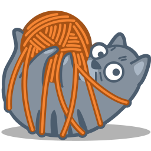

# Cat Pics Generator



## Descrição

O **Cat Pics Generator** é uma aplicação web que permite aos usuários gerar e visualizar imagens de gatos aleatórias. Com uma interface intuitiva e responsiva, os usuários podem facilmente navegar entre as imagens e explorar o conteúdo divertido e adorável de gatos.

## Funcionalidades

- Geração de imagens aleatórias de gatos.
- Interface responsiva e amigável.
- Links para redes sociais.
- Seções dedicadas para Home, Sobre e Contato.

## Tecnologias Utilizadas

- **Frontend:**
  - ReactJS
  - Bootstrap
  - CSS
- **Backend:**
  - APIs externas (The Cat API)

## Instalação

Siga os passos abaixo para rodar a aplicação localmente:

1. Clone o repositório:
   ```bash
   git clone https://github.com/Grazziano/cat-pics-generator.git
   ```

2. Navegue até o diretório do projeto:
   ```bash
   cd cat-pics-generator
   ```

3. Instale as dependências:
   ```bash
   npm install
   ```

4. Inicie a aplicação:
   ```bash
   npm run dev
   ```

5. Acesse a aplicação no seu navegador em `http://localhost:3000`.

## Uso

1. Ao abrir a aplicação, você verá uma navbar na parte superior com links para as diferentes seções.
2. Clique no botão para gerar uma nova imagem de gato.
3. Navegue pelas seções para mais informações sobre a aplicação.

## Contribuição

Contribuições são bem-vindas! Se você deseja contribuir com melhorias ou correções, siga estas etapas:

1. Faça um fork do repositório.
2. Crie uma branch para sua feature:
   ```bash
   git checkout -b minha-nova-feature
   ```
3. Faça suas alterações e commit:
   ```bash
   git commit -m 'Adicionando uma nova feature'
   ```
4. Faça push da sua branch:
   ```bash
   git push origin minha-nova-feature
   ```
5. Abra um Pull Request.

## Licença

Este projeto é licenciado sob a [MIT License](LICENSE).
